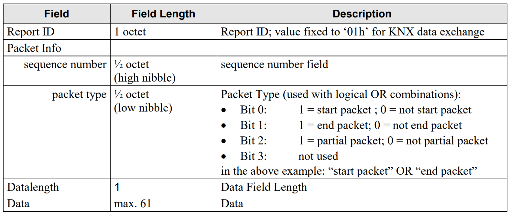
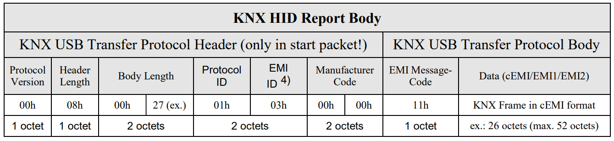
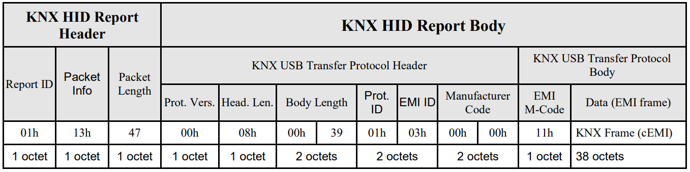
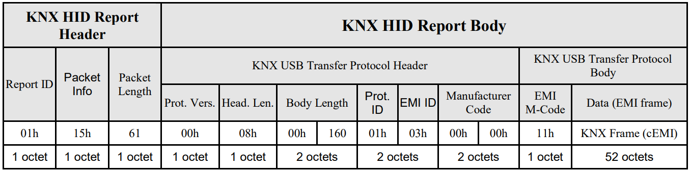
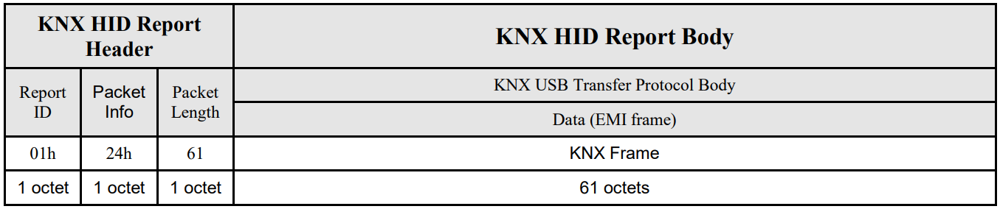
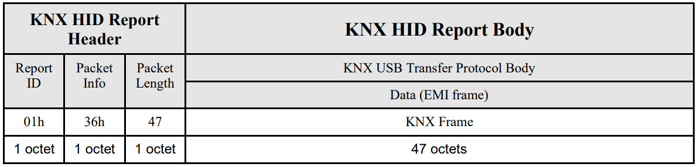

# 3 KNX USB Interface [1]
## 3.3 USB device class(es) used for KNX data exchange
### 3.3.2 Device class supported by KNX system tools: HID class
#### 3.3.2.3 HID class pipes
A HID Class device communicates with the HID Class driver using either the Control (default) pipe or an 
Interrupt pipe. The Control pipe is used for 
- receiving and responding to requests for USB control and class data, e.g. report descriptor request/response;
- transmitting data when polled by the HID Class driver; and 
- receiving data from the host.

The Interrupt pipe is used for
- receiving asynchronous (unrequested) data from the device and
- transmitting low latency data to the device.

The Interrupt Out pipe is optional. If a device declares an Interrupt Out endpoint, then the host transmits Output reports to the device through the Interrupt Out endpoint. If no Interrupt Out endpoint is declared then Output reports are transmitted to a device through the Control endpoint.

#### 3.3.2.4 HID Class endpoint layout in KNX USB Interface Device
The following endpoint layout shall be implemented in a KNX USB Interface Device to be supported by 
the KNX system tools.

| Endpoint     | Transfer Type| FIFO/Buffer length | description           |
|:-------------|:-------------|:-------------------|:----------------------|
| EP0 IN       | Control      | 8 octets           | Standard USB Requests |
| EP0 OUT      | Control      | 8 octets           | Standard USB Requests |
| EP1 IN       | Interrupt    | 64 octets          | KNX data transfer (tunnelling), including KNX local device management. |
| EP1 OUT      | Interrupt    | 64 octets          | KNX data transfer (tunnelling), including KNX local device management. |

## 3.4 KNX USB HID class frames
### 3.4.1 HID report frame
#### 3.4.1.1 HID report frame structure

*Figure 12 – HID Report frame structure*

*Figure 13 - HID Report Structure*

#### 3.4.1.2 KNX HID report header
##### 3.4.1.2.1 Report ID
The Report ID allows the HID Class host driver to distinguish incoming data, e.g. pointer from keyboard 
data, by examining this transfer prefix. The Report ID is a feature, which is supported and can be 
managed by the Host driver.

...  

For KNX data exchange
- Report ID field shall be used and
- the Report ID value shall have the fixed value 01h.

##### 3.4.1.2.2 Sequence number
If the length of a KNX frame to be passed through USB exceeds the maximal length of the KNX HID 
Report Body, this is 61 octets, the KNX frame shall be transmitted in multiple HID reports.
- Unused bytes in the last HID report frame shall be filled with 00h.
- The first HID report frame shall have sequence number 1. Also if a single HID report is sufficient for the transmission of the KNX frame, this single HID report shall have sequence number 1. The use of sequence number 0 is not allowed. The sequence number shall be incremented for each next HID report that is used for the transmission of a KNX frame.

| Sequence Number Value | Description                 |
|:----------------------|:----------------------------|
| 0h                    | reserved; shall not be used |
| 1h                    | 1st packet (start packet)   |
| 2h                    | 2nd packet                  |
| 3h                    | 3rd packet                  |
| 4h                    | 4th packet                  |
| 5h                    | 5th packet                  |
| other values          | reserved; not used          |
*Figure 14 - Sequence number*

###### Error handling
The receiver of the HID report (USB host or USB device) shall evaluate the sequence number field. If the 
received sequence number does not equal the expected sequence number, the HID report and possibly the 
entire KNX frame transmission if a frame is transmitted using multiple HID reports shall be ignored.

If the transmission of a KNX frame uses multiple HID reports and a new KNX frame transmission starts 
(a start packet with sequence number 1 is received), then the old unfinished KNX frame shall be ignored; 
the newly started KNX frame shall be evaluated.

##### 3.4.1.2.3 Packet type
The packet type bit-set as specified in clause 3.4.1.1 shall be used in HID Reports as specified in Figure 15.

| Packet Type Value     | Description                                     |
|:----------------------|:------------------------------------------------|
| 0h                    | reserved / not allowed                          |
| 3h (0011b)            | start & end packet (1st and last packet in one) |
| 4h (0100b)            | partial packet (not start & not end packet)     |
| 5h (0101b)            | start & partial packet                          |
| 6h (0110b)            | partial & end packet                            |
| all other values      | reserved; not allowed                           |

*Figure 15 – Packet type overview*

- if length of the KNX USB Transfer Frame ≤ 61 octets: start packet = end packet
- a start packet is a partial packet or the end packet
- an end packet is a partial packet or the start packet

##### 3.4.1.2.4 Datalength
The data length is the number of octets of the data field (KNX HID Report Body). This is the information 
following the data length field itself. The maximum value is 61.

#### 3.4.1.3 Data (KNX HID report body)
The data field (KNX HID Report Body) consists of the KNX USB Transfer Header and the KNX USB 
Transfer Body (example for an L_Data_Request in cEMI format):

*Figure 16 – KNX HID Report Body structure*

The KNX USB Transfer Protocol Header shall only be located in the start packet. 
A transmission that needs more than one HID Report transfer shall divide the EMI frame (KNX USB 
Transfer Protocol Body, excl. EMI Message Code) after the 52nd octet for the HID Report’s start packet 
(after each further 61 octets for following HID Report packets).

##### 3.4.1.3.1 Protocol version
The protocol version information shall state the revision of the KNX USB Transfer Protocol that the 
following frame (from header length field on) is subject to. The only valid protocol version at this time is 
‘0’.

##### 3.4.1.3.2 Header length
The Header Length shall be the number of octets of the KNX USB Transfer Protocol Header.  
Version ‘0’ of the protocol shall always use header length = 8.

###### Error handling
If the value of the Header Length field in the KNX USB Transfer protocol header is not 8, the receiver 
shall reject the entire HID Report.

##### 3.4.1.3.3 Body length
The Body Length shall be the number of octets of the KNX USB Transfer Protocol Body.  
Typically this is the length of the EMI frame (EMI1/2 or cEMI) with EMI Message Code included. For a 
KNX Frame with APDU-length = 255 (e.g. extended frame format on TP1), the length of the KNX USB 
Transfer Protocol Body can be greater than 255. Therefore two octets are needed for the length 
information.

##### 3.4.1.3.4 Protocol identifiers
It is required that an interface device connecting a PC with a field bus via an USB link can not only 
transfer KNX frames but also other protocols. For this purpose, the field Protocol ID (octet 5) in the 
header shall be used as the main protocol separator.  
The information whether a frame is a request, a response or an indication shall be given by the contents of 
the field EMI Message Code. This is the 1st octet in the KNX USB Transfer Protocol Body.

###### Coding of Protocol ID
The 1st octet shall be an identifier that shall represent the field bus protocol transmitted within the USB 
frame.

| Protocol | ID Description                                    |
|:---------|:--------------------------------------------------|
| 00h      | reserved                                          |
| 01h      | KNX Tunnel                                        |
| 02h      | M-Bus Tunnel (Metering-Bus, acc. to CEN TC294) a) |
| 03h      | BatiBus Tunnel                                    |
|          | Reserved                                          |
| 0Fh      | Bus Access Server Feature Service b)              |
|          | Reserved                                          |
| EFh      | Reserved                                          |
| FFh      | reserved (ESCAPE for future extensions)           |

a) The KNX RF physical media is also used for transmission of information in M-Bus 
format. A KNX-RF to USB interface supporting also transmission of RF Metering 
information shall use an own protocol ID in the KNX USB Transfer Protocol 
Header.  
b) Please refer to clause 3.5 for the specification of this protocol..

*Figure 17 – Protocol and Protocol ID overview*

###### Coding of EMI ID octet (for “KNX Tunnel”):
For a KNX Tunnel, the 6th octet within the KNX USB Transfer Protocol Header shall be an identifier 
representing the EMI format used in the KNX USB Transfer Protocol Body.  
The EMI ID octet is used as an enumeration: each value (0 … 2) shall represent an own EMI format. Its 
value shall not be ‘0’ if the Protocol ID indicates a ‘KNX Tunnel’.

| EMI ID | Description                             |
|:-------|:----------------------------------------|
| 00h    | Reserved                                |
| 01h    | EMI1                                    |
| 02h    | EMI2                                    |
| 03h    | common EMI                              |
| 04h    | not used                                |
| 05h    | not used                                |
|        | not used                                |
| EFh    | not used                                |
| FFh    | reserved (ESCAPE for future extensions) |
*Figure 18 – EMI and EMI ID overview*

##### 3.4.1.3.5 Manufacturer code
In protocol version ‘0’, this field shall always be present.  
Value ‘0000h’ shall be used for transmission of frames that fully comply with the standardised field bus 
protocol, indicated with Protocol ID octet. In case of a KNX Link Layer Tunnel, this field shall be set to 
‘0000h’.  
If not fully complying with the standard indicated in the Protocol ID field, then the manufacturer code 
field of the KNX USB Transfer Protocol Header (7th & 8th octet) shall filled in with the manufacturer’s 
KNX member ID. Example: an own manufacturer specific application layer is used on top of standardised 
lower layers.

### 3.4.2 KNX tunnelling
For communication between a tool on a PC and a KNX device connected to the KNX network, KNX 
frames are tunnelled on the USB link using one of the EMI formats.
The time-out for a KNX tunnelling is 1 s. This is, a KNX USB Interface Device shall be able to receive a 
tunnelling frame, transmit it on the KNX medium and send the local confirmation back to the tool within 
1 s. This is a recommended value which shall be complied to under normal bus load.

#### 3.4.2.1 Examples of tunnelled KNX frames
Example of a KNX frame (L_Data_Request in cEMI format) with a length of less than 52 octets.

Example of a KNX frame (L_Data_Request in cEMI format) with a length of 160 octets.
* 1st (start) packet:

* 2nd (partial) packet:

* 3rd (end) packet:

### 3.4.3 Local device management
Local device management in this context means the “KNX Management”, e.g. reading/writing the 
Individual Address of the “local device” or other. Management of the local device on USB level is not in 
the scope of this document.
Local device management is done using the local device management services provided by the EMI 
standard (EMI1/2 or common EMI), that is implemented in the local interface.

# Sources
[1] [KNX Specifications](https://my.knx.org/de/shop/knx-specifications)